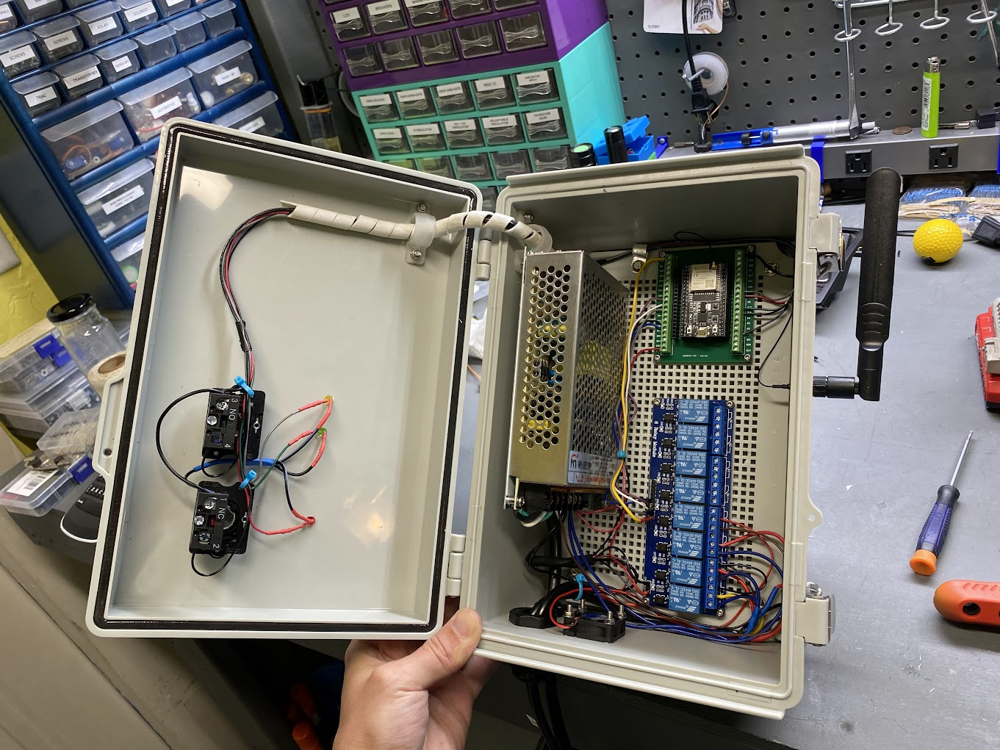
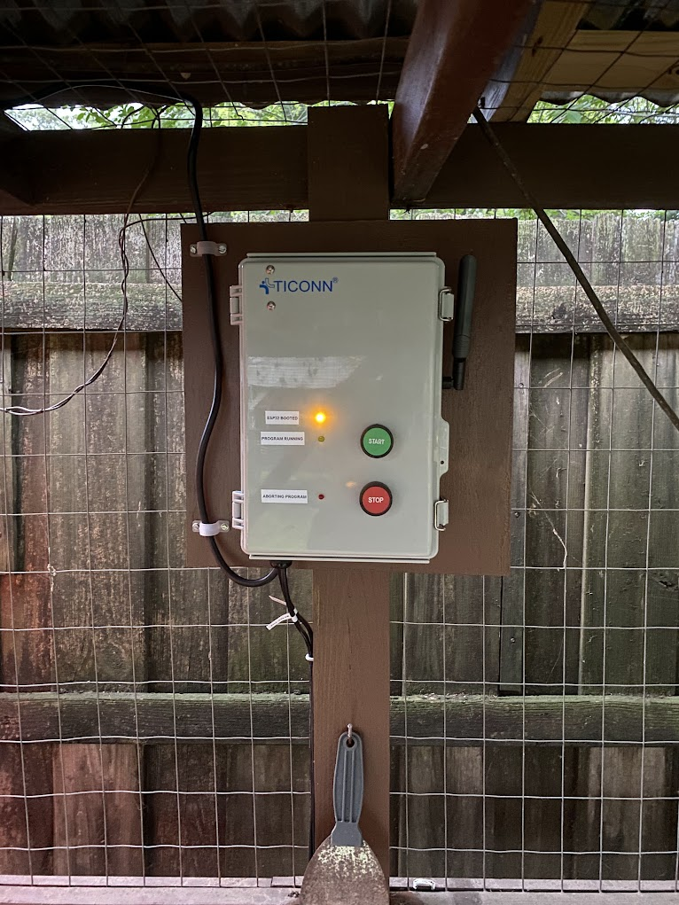
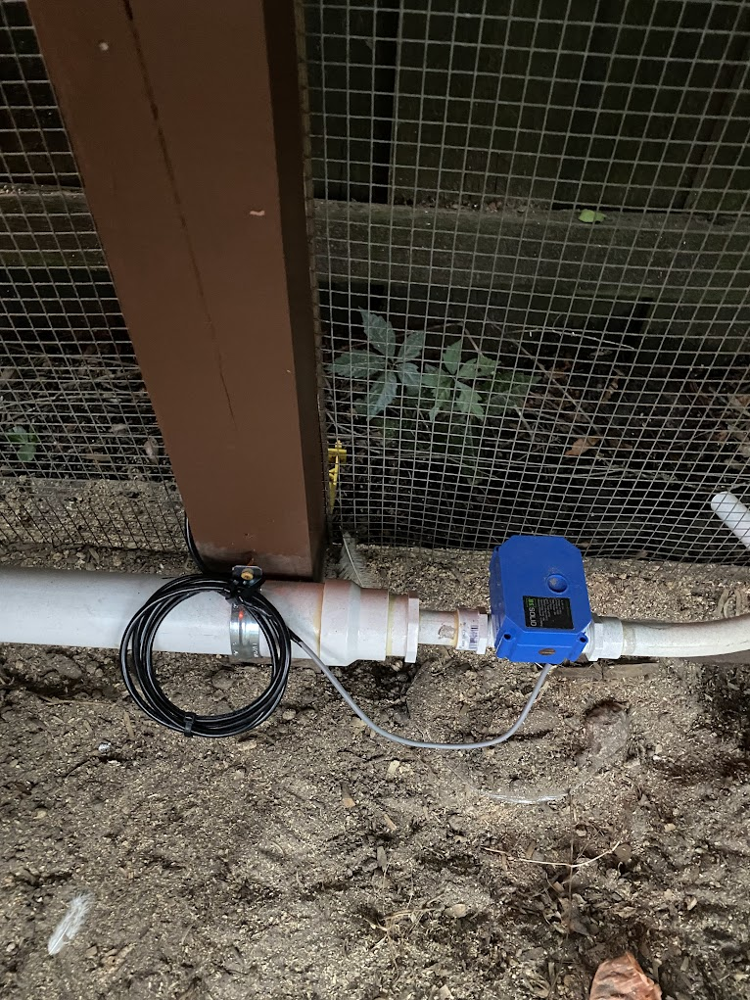
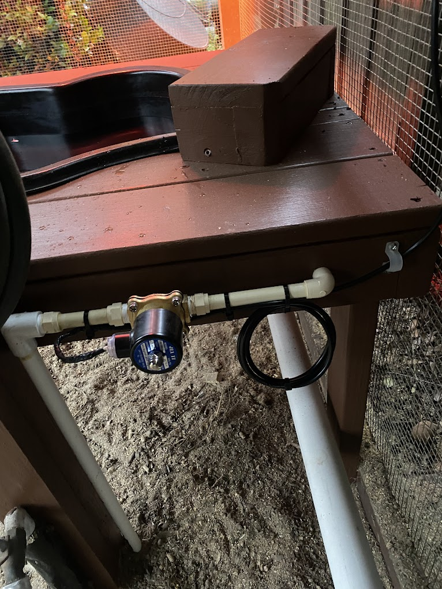
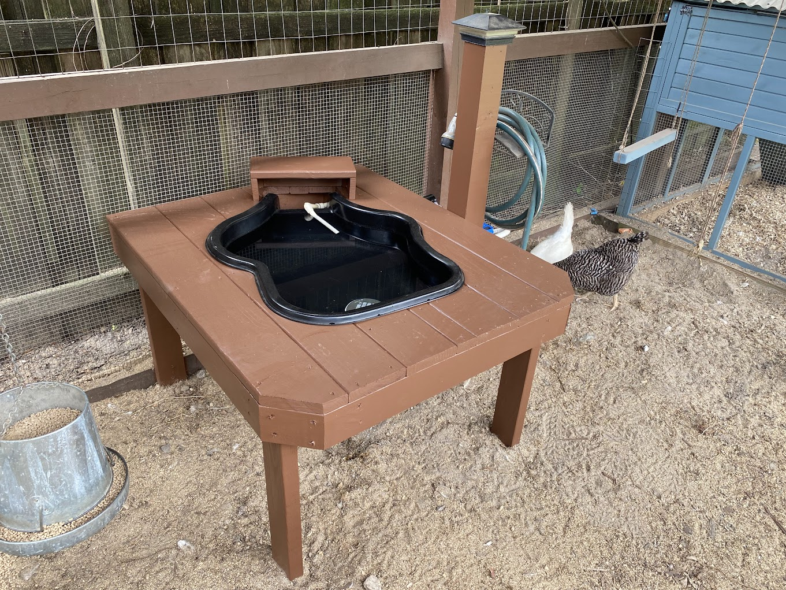

# Chicken Water Controller (April, 2023)

A MicroPython program that runs on the ESP32 microcontroller.

## Description

Having backyard chickens can be a rewarding hobby. Not having to purchase eggs at a grocery
store, along with having a cleanup crew to help remove pests and weeds from your yard and
garden is an added bonus.

Unfortunately, some of the maintenance and care required to maintain a healthy flock can become
a burden after time. Automation can be a way to ensure your birds are taken care of and have
the resources they need to thrive.

For this project, I decided to automate the task of draining stale and often contaminated drinking
water and refilling it on a daily basis. The solution I came up with was having an ESP32 microcontroller
handle opening drain and fill valves attached to a plastic tub.

## Hardware

Here are the major components that I needed for the project. Small wire, screws, solder, etc. are needed,
but are not mentioned on this list.

- Purchased on Amazon
	- ESP32-WROOM-32U DevKitC Dev Board
	- ESP32 GPIO Breakout Board
	- External WiFi antenna with MHF4 to SMA adapter
	- Relay Board (capable of being driven by 3.3V signal outputs)
	- Multiple Voltage Power Supply 5V/12V/24V
	- Momentary Push Button Switches
	- Waterproof enclusure (11" x 7.5" x 5.5")
	- Power cord (with ground)
	- 18Ga 3-conductor wire (enough to go from the relay board to each valve/solenoid)
	- Motorized Ball Valve (3/4" | 9-24 Volt) for drain
	- Electric Solenoid Valve (1/2" | 12 Volt) for fill
	- Water Hammer Arrestor (1/2") - Helps with hammering when solenoid closes
- Purchased at Lowe's
	- 9-Gallon HDPE Fish Pond Liner (moulded)
	- Pressure Treated Lumber
	- Exterior Paint
	- PVC drain pipe
	- PVC sch-40 pipe
	- PVC glue, couplers, male adapters, 90s, and reducers
	- Sink Drain w/ Grate
	- Deck Screws
	- Wood Glue
	- Plumbing Strap

## Software

This project uses MicroPython running on the ESP32

### Software Features

- Watchdog timer to reset ESP32 if main program stops
- Syslog to remote server for logging
- NTP to ensure accurate time in the absence of a RTC
- MicroCRON for scheduling operation of the drain and fill procedure
- Hardware interrups from the button pushes to stop in-progress operations

## Theory of operation

Upon device power-up, it will attempt to connect to the configured WiFi SSID after waiting 1 full second
for the devices radio to interface to come up. If unable to connecto to WiFi within 30 seconds, the device
will reset and start the process over.

The device now checks to make sure required Python packages are installed and installs them using uPIP if
necessary.

The device will then start the WebREPL service for remote management connectivity/updates and listen for
connections.

The NTP server will be contacted and an attempt to sync the current time will be made.

Program main loop is called.

Syslog is initialized and startup messages are sent to the remote syslog server.

Controller class enters its program loop. Watchdog timer is enabled and must be fed every 10 minutes. Failure to
feed the watchdog will result in the ESP32 resetting.

The Controller class maintains a current state which can be 6 possible states (IDLE, DRAINING, FLUSHING, FILLING,
COMPLETE, STOP).

- State: IDLE - Loop is running and watchdog timer is being fed. No values are open.
- State: DRAINING - Drain valve is open and timer is counting down for the length of the drain time.
- State: FLUSHING - Fill and drain valves are both open. Fresh water is being used to flush any debris that might
still be in the tub after drain operation. Runs until flush timer is up.
- State: FILLING - Fill valve is open. Tub is filling. Runs until fill timer is up.
- State: COMPLETE - All valves are closed. Sends log entry to syslog for successful operation.
- State: STOP - Triggered by hardware interrupt. All valves commanded to close and current procedure ends.

In a typical flow, the state is in IDLE condition until the procedure is triggered by CRON to begin. The system
logs that it is beginning the procedure and moves to the DRAINING state in which the drain valve is opened. The
system waits for 90 seconds to pass which is long enough for tub to fully drain. The system then moves to the
FLUSHING state and the fill valve is opened. Fresh water begins to flow and flush debris toward the drain. 30 seconds
is allowed to elapse and then fill valve is closed. The drain valve is also commanded closed and once the close time
has elapsed state is changed to FILLING. The fill valve is opened and the tub is allowed to fill for 50 seconds which
brings the water level to the desired depth with room for slight variation due to water pressure. The fill valve
is closed and the state is changed to COMPLETE. The system logs that the procedure has successfully completed and the
state is set to IDLE.

## Build Pictures

Tub in wooden frame

Assembled frame

Inside of control box

Control box mounted in chicken coop

Drain valve

Fill valve

Completed system
